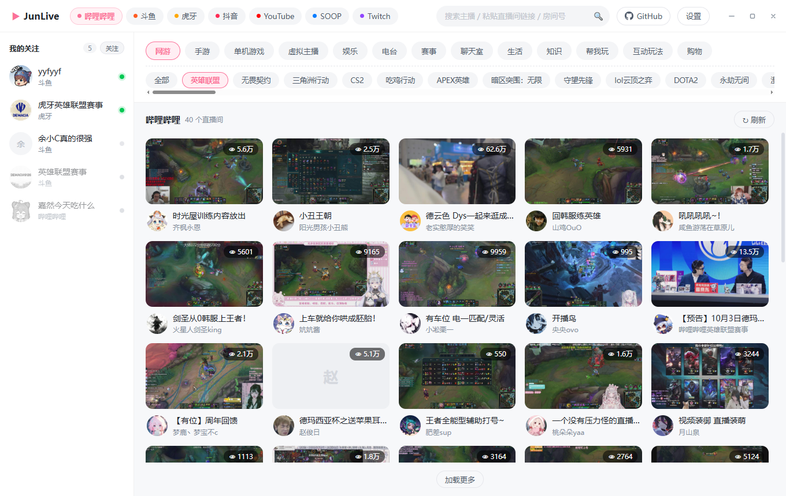
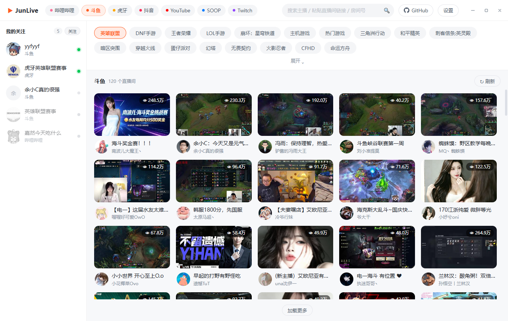
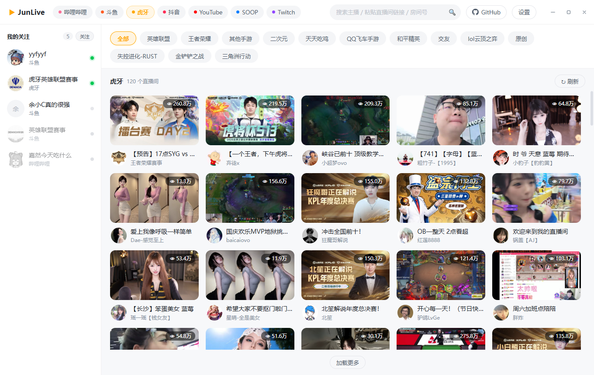
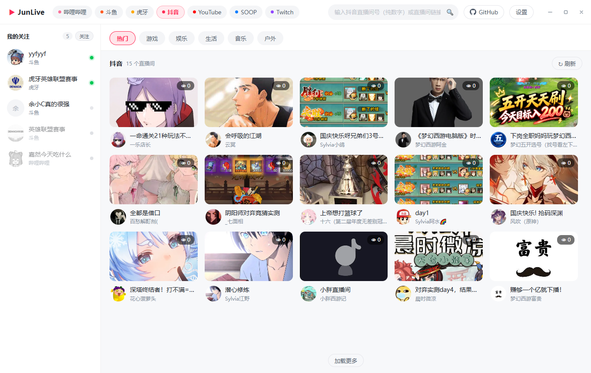
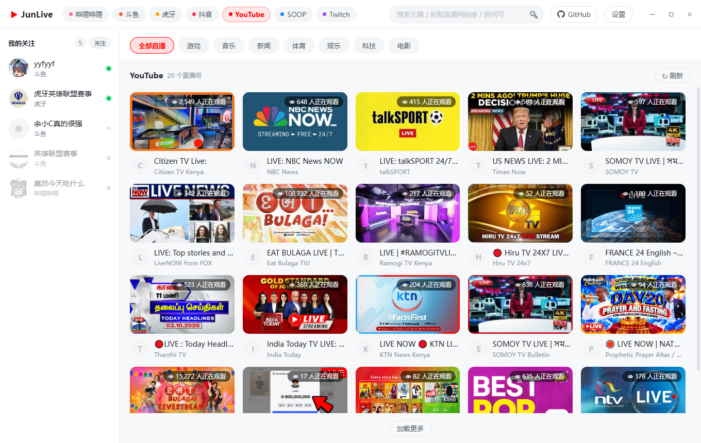
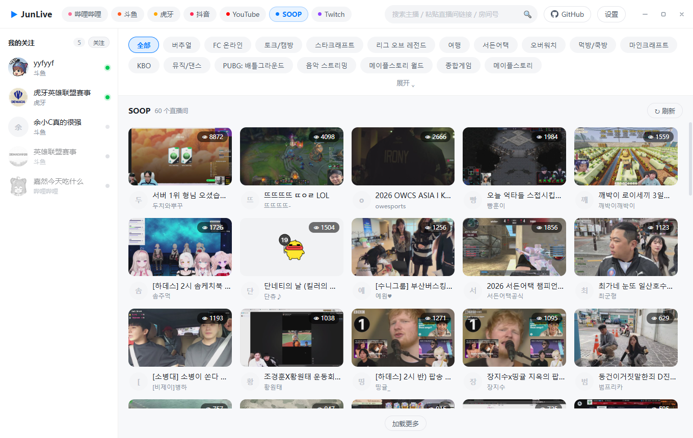
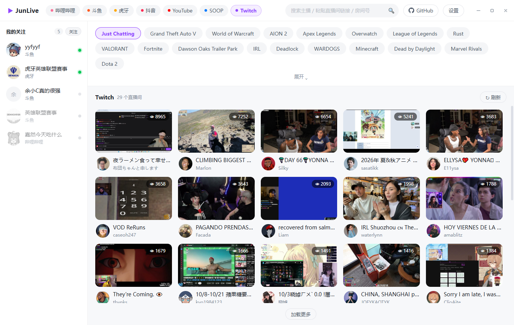
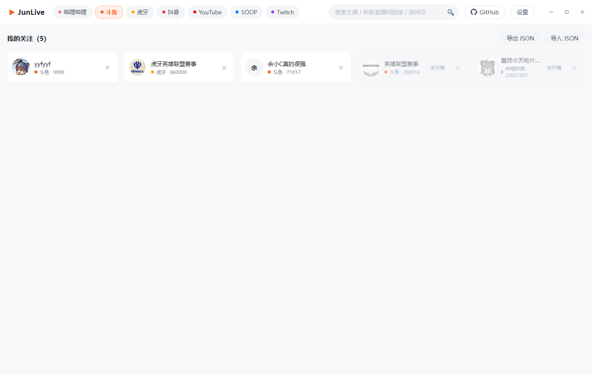
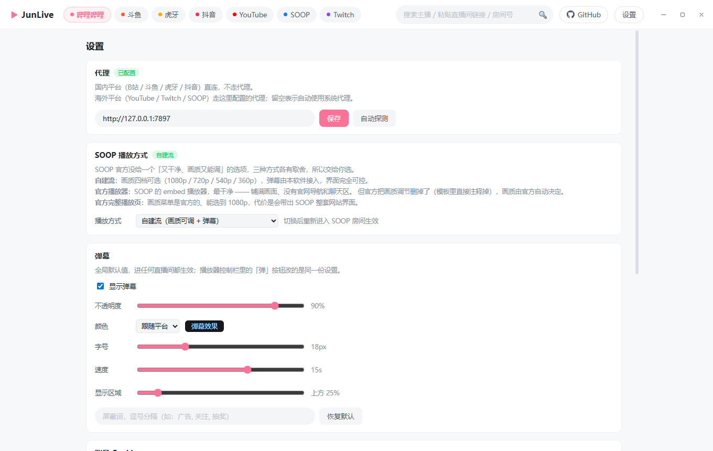
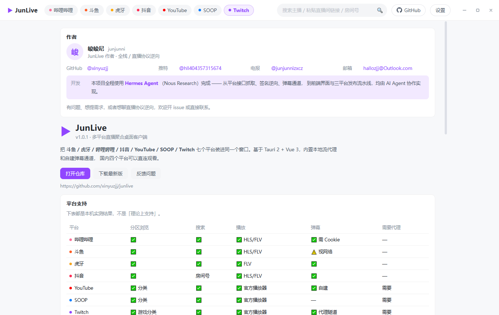

<div align="center">

# JunLive

**把七个直播平台装进同一个窗口的桌面客户端**

斗鱼 · 虎牙 · 哔哩哔哩 · 抖音 · YouTube · SOOP · Twitch

[](https://github.com/xinyuzjj/junlive/releases/latest)
[](https://github.com/xinyuzjj/junlive/actions)
[](#download)
[](https://tauri.app)
[](https://vuejs.org)
[](LICENSE)

<sub>

[界面预览](#preview) · [下载安装](#download) · [平台支持](#platforms) · [功能](#features) · [技术栈](#stack) · [从源码构建](#build) · [已知限制](#limits) · [移动端](#mobile) · [致谢](#credits) · [许可证](#license)

</sub>

</div>

> ## ☕ [点这里支持本项目 →](#donate)
>
> JunLive 免费、无广告、不收集任何数据。
> 如果它帮你省下了开浏览器、挂代理、来回切平台的功夫，可以请作者喝杯咖啡 ——
> **完全自愿，不打赏也照样用、照样更新。**

---

<a id="preview"></a>

## 🖼️ 界面预览

七个平台各一套界面，顶栏一键切换；左边是关注列表（按在播状态排序）：

<table>
<tr>
<td align="center"><b>哔哩哔哩</b><br></td>
<td align="center"><b>斗鱼</b><br></td>
</tr>
<tr>
<td align="center"><b>虎牙</b><br></td>
<td align="center"><b>抖音</b><br></td>
</tr>
<tr>
<td align="center"><b>YouTube</b><br></td>
<td align="center"><b>SOOP</b><br></td>
</tr>
<tr>
<td align="center"><b>Twitch</b><br></td>
<td align="center"><b>关注页</b><br></td>
</tr>
<tr>
<td align="center"><b>设置</b><br></td>
<td align="center"><b>关于 / 致谢</b><br></td>
</tr>
</table>

---

<a id="download"></a>

## 📦 下载安装

去 **[Releases](https://github.com/xinyuzjj/junlive/releases/latest)** 页面下载对应系统的安装包：

| 系统 | 文件 | 说明 |
|---|---|---|
| **Windows** | `JunLive_x.y.z_x64-setup.exe` | NSIS 安装包，双击安装 |
| | `JunLive_x.y.z_x64_en-US.msi` | MSI 安装包，适合批量部署 |
| **macOS** | `JunLive_x.y.z_aarch64.dmg` | Apple Silicon（M 系列芯片） |
| | `JunLive_x.y.z_x64.dmg` | Intel 芯片 |
| **Linux** | `JunLive_x.y.z_amd64.AppImage` | 免安装，`chmod +x` 后直接运行 |
| | `JunLive_x.y.z_amd64.deb` | Debian / Ubuntu：`sudo dpkg -i xxx.deb` |
| | `JunLive_x.y.z_x86_64.rpm` | Fedora / RHEL：`sudo rpm -i xxx.rpm` |
| **Android** | `JunLive_vX.Y.Z-android-arm64.apk` | arm64 手机 **侧载安装**（debug 免签名包，非上架包） |

> [!NOTE]
> **macOS 首次打开提示「无法验证开发者」**：右键点应用 → 打开 → 再点「打开」，
> 或执行 `xattr -dr com.apple.quarantine /Applications/JunLive.app`（未签名应用的正常提示）。

---

<a id="platforms"></a>

## 🧩 平台支持现状

> 下表**均为本机实测**，不是「理论上支持」。

| 平台 | 分区浏览 | 搜索 | 播放 | 弹幕 | 需要代理 |
|---|---|---|---|---|---|
| 哔哩哔哩 | ✅ | ✅ | ✅ HLS / FLV | ✅ 需 Cookie | — |
| 斗鱼 | ✅ 537 个分区 | ✅ | ✅ HLS / FLV | ⚠️ 视网络 | — |
| 虎牙 | ✅ | ✅ | ✅ FLV（HLS 常 403） | ✅ | — |
| 抖音 | ✅ | 房间号直达 ¹ | ✅ HLS / FLV | ✅ | — |
| YouTube | ✅ 分类 | ✅ | ✅ 官方播放器 ² | ✅ 自建 live_chat | 需要 |
| SOOP | ✅ 分类 | ✅ | ✅ 自建流 / 官方播放器 ² | ✅ 自建 WebSocket | 需要 |
| Twitch | ✅ 游戏分类 | ✅ | ✅ 官方播放器 ² | ✅ 走代理隧道 | 需要 |

<sub>

**¹ 抖音搜索**：平台没有可用的匿名搜索接口（`/aweme/v1/web/live/search/` 一律返回
`{"status_code":2483,"status_msg":"请先登录，再继续搜索吧"}`，是平台硬限制）。
所以搜索框直接输**直播间号**或粘直播间链接。

**² 官方播放器**：YouTube / Twitch / SOOP 走各自的官方 iframe 播放器。
YouTube 的分片现在强制 PO token，自建播放器一律 403；Twitch 用自建播放器清晰度会被 ABR 反复切换。
交给官方播放器处理鉴权、清晰度和重连最稳。

</sub>

<details>
<summary><b>SOOP 为什么做成「播放方式三档可选」</b></summary>

官方没给一个「又干净、画质又能调」的选项，所以把选择权交给用户（设置 → SOOP 播放方式）：

| 档位 | 画面 | 画质 | 弹幕 | 额外界面 |
|---|---|---|---|---|
| **自建流**（默认） | 铺满 | 四档可选（1080p / 720p / 540p / 360p） | ✅ | 无 |
| 官方播放器 | 铺满 | 官方自动决定 | ✅ | 无 |
| 官方完整播放页 | 非铺满 | 官方菜单可选 1080p | ✅ | 带整套官网界面 |

官方 `/embed` 播放器最干净，但官方在服务端模板里把画质选择器**用 HTML 注释删掉了**
（`<!-- 화질선택 임베디드는 미노출 -->`），且该页除 `fromApi=` 外不读任何 URL 参数，
外面无法把画质框叫回来 —— 这是官方的产品决定，不是配置问题。

</details>

---

<a id="features"></a>

## ✨ 功能

- **七个平台统一界面** —— 浅色卡片流，平台一键切换
- **关注列表** —— 跨平台收藏主播，绿点=直播中 / 灰点=未开播 / 黄点=未知。
  在线状态**持久化在关注记录里**，一进页面顺序就是对的（不用等异步刷新）
- **弹幕（自建通道，七个平台全支持）** —— 斗鱼 / 虎牙 / B站 / 抖音 / YouTube / Twitch / **SOOP**
  - 可调不透明度 / 字号 / 速度 / 显示区域 / 屏蔽词
  - **颜色可选**：跟随平台 / 纯白 / 自定义取色
  - 只显示**进入直播间之后**的消息（进房前的历史弹幕不飘）
  - 高频房间用 `requestAnimationFrame` 批量合并渲染，走 GPU 合成，不拖累视频解码
- **窗口全屏** —— CSS 全屏铺满应用窗口，不动系统窗口、不与官方 iframe 抢全屏，弹幕层保留
- **自绘标题栏** —— 无边框窗口 + 自定义最小化 / 最大化 / 关闭
- **线路切换** —— 同一画质下多 CDN 线路可选，实时测速

---

<a id="stack"></a>

## 🛠️ 技术栈

| 层 | 选型 |
|---|---|
| 桌面外壳 | **Tauri 2**（Rust） |
| 前端 | **Vue 3** + Vite + TypeScript |
| 播放内核 | **hls.js**（HLS）+ **mpegts.js**（FLV） |
| 后端 | Rust：reqwest + axum + tokio |
| 流代理 | 内置 axum 本地 HTTP 服务器 |

<details>
<summary><b>为什么需要一个内置的本地流代理？</b></summary>

国内平台的流都带防盗链（Referer / UA / Cookie），浏览器里 hls.js 没法自定义这些请求头，
还有跨域限制。所以每个上游地址都在本地注册成一个短 id，前端只播
`http://127.0.0.1:<port>/s/<id>`，由 Rust 侧带上正确请求头回源；
m3u8 播放列表逐行重写，分片地址同样走代理。

</details>

---

<a id="build"></a>

## 🚀 从源码构建

```bash
# 依赖：Node 20+ / Rust stable / 各平台的 Tauri 系统依赖
# https://tauri.app/start/prerequisites/

npm install
npm run tauri dev      # 开发模式（Vite + Rust，自动开窗口）
npm run tauri build    # 打包当前系统的安装包
```

产物在 `src-tauri/target/release/bundle/`。

<details>
<summary><b>命令行自测</b>（不开 GUI，验证接口通不通）</summary>

```bash
cd src-tauri && cargo build

./target/debug/junlive.exe --test platforms              # 平台列表
./target/debug/junlive.exe --test categories bilibili     # 分区
./target/debug/junlive.exe --test rooms douyu 1_1         # 分区下的房间
./target/debug/junlive.exe --test search huya 英雄联盟     # 搜索
./target/debug/junlive.exe --test room twitch yuyuta0702  # 房间详情 + 播放地址
./target/debug/junlive.exe --test danmaku huya 825290 20  # 实测拉 20 秒弹幕

# 端到端：起本地代理、拉 m3u8、再实测拉一个分片
./target/debug/junlive.exe --test serve bilibili 26406842
```

</details>

<details>
<summary><b>自动发布</b>（推 tag 出三平台安装包）</summary>

推一个 tag 会触发 [`.github/workflows/release.yml`](.github/workflows/release.yml)，
自动构建三平台安装包并创建 Release：

```bash
git tag v1.0.1 && git push origin v1.0.1
```

</details>

---

<a id="settings"></a>

## ⚙️ 设置项

应用内「设置」页：

1. **代理** —— 国内四平台直连不走代理；YouTube / Twitch / SOOP 走这里配置的代理。
   留空 = 自动探测系统代理。
2. **SOOP 播放方式** —— 自建流 / 官方播放器 / 官方完整播放页（见上文说明）。
3. **弹幕** —— 全局默认值（开关 / 不透明度 / 颜色 / 字号 / 速度 / 区域 / 屏蔽词），
   和播放器控制栏里的「弹」按钮是同一份设置。
4. **账号 Cookie**
   - **YouTube**：点「打开 YouTube 登录窗口」直接登录，Cookie 自动保存
   - **B站**：弹幕接口有风控，匿名访问返回 `-352`，需要贴 `buvid3` + `SESSDATA`
5. **数据管理** —— 清空关注列表 / 清空全部 Cookie

---

<a id="tree"></a>

## 📁 目录结构

```
junlive/
├── src/                          # Vue 前端
│   ├── api.ts                    # invoke 封装 + 直播间链接解析
│   ├── store.ts                  # 平台 / 关注列表状态
│   ├── dmSettings.ts             # 弹幕设置（全局单例 + localStorage）
│   ├── soopMode.ts               # SOOP 播放方式（自建流 / 官方播放器 / 官方完整页）
│   ├── embed.ts                  # 官方播放器嵌入地址（YouTube / Twitch / SOOP）
│   ├── components/
│   │   ├── Player.vue            # hls.js / mpegts.js 播放器 + 弹幕飞屏
│   │   └── DmSet.vue             # 弹幕设置面板
│   └── views/
│       ├── Home.vue              # 分区 + 房间网格 + 左侧关注栏
│       ├── Room.vue              # 播放页（多线路 + 弹幕）
│       ├── Follow.vue            # 关注列表（JSON 导入导出）
│       └── Settings.vue
└── src-tauri/
    ├── Cargo.toml
    ├── rust-toolchain.toml       # 固定 GNU 工具链（原因见下）
    └── src/
        ├── lib.rs                # Tauri commands + CLI 自测
        ├── model.rs              # 统一数据模型
        ├── net.rs                # HTTP 客户端（直连 / 走代理 / 回源）
        ├── proxy.rs              # 本地流代理（m3u8 重写 + 分片透传）
        ├── danmaku/              # 七个平台的弹幕通道
        │   ├── mod.rs
        │   ├── bilibili.rs       # WBI 签名 + getDanmuInfo
        │   ├── douyu.rs          # 自有 TCP 协议
        │   ├── huya.rs           # 自有 WS 协议（uid 取房间页 lp）
        │   ├── douyin.rs         # X-Bogus 签名（QuickJS）+ WS
        │   ├── soop.rs           # WebSocket + 子协议 chat + 自有分帧
        │   ├── twitch.rs         # IRC over WS（走代理隧道）
        │   └── youtube.rs        # live_chat 长轮询
        └── platforms/            # 七个平台的实现
            ├── bilibili.rs
            ├── douyu.rs          # 含 getEncryption + auth 签名（移植自 streamlink）
            ├── huya.rs           # anti_code 签名
            ├── douyin.rs         # a_bogus 签名（纯 Rust）
            ├── youtube.rs
            ├── soop.rs
            └── twitch.rs         # 匿名 GQL
```

---

<a id="windows"></a>

## 🪟 编译环境说明（Windows 特有）

<details>
<summary><b>为什么要固定 GNU 工具链</b></summary>

如果本机没装 Windows SDK（`C:\Program Files (x86)\Windows Kits\10\Lib` 为空），
MSVC 工具链链接时会报 `LNK1181: cannot open input file 'kernel32.lib'`。
项目用 `src-tauri/rust-toolchain.toml` 固定了 **`stable-x86_64-pc-windows-gnu`** 工具链来绕开。

想切回 MSVC：

1. 安装 Windows SDK（VS Installer → 修改 → 单个组件 → Windows 11 SDK）
2. 删掉 `src-tauri/rust-toolchain.toml`
3. 跑 `cargo build` 前先执行 `vcvars64.bat`
   （Git-Bash 里必须经由 cmd 调用，否则会误用 MSYS 自带的 `link` 导致 `link: extra operand`）

> CI（GitHub Actions）上用 `RUSTUP_TOOLCHAIN: stable` 环境变量覆盖这个固定值，
> 所以云端构建走的是各平台默认工具链，不受影响。

GNU 工具链下还有一个坑：`crate-type` 不能带 `cdylib`，否则链接报
`export ordinal too large`，所以 Cargo.toml 里是 `["staticlib", "rlib"]`。

</details>

---

<a id="limits"></a>

## ⚠️ 已知限制

> [!WARNING]
> 下面这些是**实测确认的平台限制或跨域物理限制**，不是待修的 bug。

| 限制 | 说明 |
|---|---|
| **抖音搜索** | 平台限制，只能输房间号（见上） |
| **斗鱼弹幕** | 部分网络环境下 8506 端口被中间设备拦截（TCP 能连但应用层零响应），代码本身没问题，视网络而定 |
| **虎牙 HLS** | `anti_code` 拼出来的 HLS 地址常返回 403，默认走 FLV（实测稳定） |
| **SOOP 画质** | 官方 `/embed` 播放器把画质选择器注释掉了，要画质可选就得走自建流或官方完整播放页 |
| **B站分区房间列表** | 官方 `second/getList` 返回 `-352`（风控），改成用分区名调搜索接口，结果基本等价 |
| **全屏时按 ESC** | 自己做的「窗口全屏」靠父页面的键盘事件听 ESC，一旦点过播放器（焦点进了官方 iframe 内部），按键不会冒泡到父页，ESC 就失效了 —— 这是跨域限制。SOOP 可以改用**官方播放器的全屏按钮**，那条路由浏览器处理，ESC 正常 |
| **手机端** | 见下方「移动端」 |

---

<a id="mobile"></a>

## 📱 移动端

Tauri 2 本身支持 Android / iOS，但**这不是把桌面版打包一下就行**，是另一套工程。

| 平台 | 状态 | 说明 |
|---|---|---|
| **Android** | ✅ **APK 已能构建** | CI 交叉编译链已逐项打通，产物 54 MB。为 **debug + 免签名** APK，只能侧载安装 |
| **iOS** | ⚠️ 真机目标可编译，模拟器受阻 | Rust 代码能为 `aarch64-apple-ios`（真机目标）编过；**模拟器目标编不过**，卡在 `rquickjs-sys`（见下）。且**没有签名证书只能出未签名产物**，装到真机要 Apple 开发者账号（$99/年） |

<details>
<summary><b>iOS 模拟器为什么编不过</b></summary>

`rquickjs-sys` 把 Rust 的 target 名原样当 `--target` 交给 clang，
而 clang 不认 `aarch64-apple-ios-sim` 这个写法（clang 用的是 `-simulator`），
于是直接报 `error: version 'sim' in target triple 'aarch64-apple-ios-sim' is invalid`。

关键是：**clang 遇到非法三元组会立刻终止**，所以在外部再补一个合法的 `--target`（我们试过
`BINDGEN_EXTRA_CLANG_ARGS_*`）也救不回来；而该 crate 自带的预生成绑定里**没有任何 iOS 目标**，
所以只能开 bindgen 现场生成。要彻底修好得给这个 crate 打补丁
（vendored + `[patch.crates-io]` 改掉 build.rs 里那一行），或等上游修。

真机目标（`aarch64-apple-ios`）的三元组 clang 是认的，所以 CI 里改成先做
**真机目标的编译验证**，至少能证明 iOS 侧代码是能编的。

</details>

<details>
<summary><b>已经处理掉的移动端特有障碍</b></summary>

- 本机流代理监听 `127.0.0.1` 走明文 HTTP，Android 9+ 默认禁止明文流量（要配 `networkSecurityConfig`）
- Cookie 存在 `%APPDATA%` 之类的**桌面路径**上，移动端没有这些环境变量
- YouTube 登录会开新窗口，而移动端只支持单个 webview
- 抖音签名要跑 QuickJS（`rquickjs`），交叉编译到 Android / iOS 需要现场生成绑定（`bindgen`）：
  Android 要喂 NDK 的 sysroot；iOS 把 `aarch64-apple-ios-sim` 映射成 clang 认的
  `arm64-apple-ios-simulator` 之后，仍被 crate 里硬编码的三元组挡住（见上）

</details>

> **结论**：桌面版是稳定可用的主线；移动端属于「能做，但是另一个工程」，
> 分发才是最大的坎 —— iOS 几乎不可能过审（聚合直播类），Android 可以侧载 APK。

---

<a id="author"></a>

## 👤 作者

<table>
<tr>
<td width="88"></td>
<td>

**峻峻尼**（junjunni） —— JunLive 作者 · 全栈 / 直播协议逆向

| 联系方式 | |
|---|---|
| GitHub | [@xinyuzjj](https://github.com/xinyuzjj) |
| 推特 | [@hll404357315674](https://x.com/hll404357315674) |
| 电报 | [@junjunnizxcz](https://t.me/junjunnizxcz) |
| 邮箱 | hallozjj@Outlook.com |

</td>
</tr>
</table>

> **开发方式**：本项目全程使用 [Hermes Agent](https://hermes-agent.nousresearch.com)（Nous Research 出品）
> 完成 —— 从平台接口抓取、签名逆向、弹幕通道，到前端界面与三平台发布流水线，
> 均由 AI Agent 协作实现。

有问题、想提需求，或者想聊直播协议逆向，欢迎开 issue 或直接联系。

---

<a id="donate"></a>

## ☕ 支持本项目

JunLive 免费、无广告、不收集任何数据，也不会因为没打赏就少更新一次。

如果它帮你省下了开浏览器、挂代理、来回切平台的功夫，可以请作者喝杯咖啡 👇

<p align="center">
  
</p>

<p align="center"><sub>微信扫码即可 · 完全自愿 · 感谢每一位使用者</sub></p>

---

<a id="credits"></a>

## 🙏 致谢

接口抓取思路参考了这些项目：

### [lemon-live](https://github.com/lemonfog/lemon-live) · 聚合形态的起点

聚合直播网站，支持虎牙 / 斗鱼 / 抖音 / 哔哩哔哩，带弹幕。
zrfme-live 的作者原话是「我长期使用 lemon-live 看直播，它用不了之后才有了这个项目」——
本项目是同一类形态的桌面端实现：七个平台放进一个窗口，列表 / 搜索 / 播放 / 弹幕四件事都自己接。

### [pure_live](https://github.com/liuchuancong/pure_live) · 平台内核与能力模型

平台内核、能力模型和播放器行为的主要参考。
本项目 `src-tauri/src/model.rs` 里那套统一数据模型（`Room` / `RoomDetail` / `PlayUrl`）
和「同一画质下多 CDN 线路可选」的播放器行为，就是照这套能力模型设计的。

### [Simple Live](https://github.com/xiaoyaocz/dart_simple_live) · 站点接口抓取思路

站点接口抓取思路参考。各平台的分区树、房间列表、搜索、房间详情、播放地址
这几条链路都顺着它摸过一遍；斗鱼 / 虎牙 / B站 / 抖音的接口这几年改了很多次，
也是靠它的实现对照定位的。

### [douyinLive](https://github.com/jwwsjlm/douyinLive) · 抖音 Webcast 弹幕接入

抖音 Webcast 弹幕接入参考（配套的 [douyinlive-proto](https://github.com/jwwsjlm/douyinlive-proto)
提供 proto 定义）。本项目的抖音弹幕通道 —— wss 长连接 + `PushFrame` / `Response` / `Message`
三层 protobuf 解包 + X-Bogus 签名 + 握手必须带 `ttwid` Cookie —— 就是照这个实现的。

### [Multistream](https://github.com/ilanzgx/multistream) · 桌面形态参考

单窗口聚合多个平台的形态，以及「流从官方播放器加载」的思路
（README 原话：*Streams load from the official players*）。
本项目的 YouTube / Twitch / SOOP 三个平台直接沿用了这个做法。

### [DTV](https://github.com/chen-zeong/DTV) · 关注列表与全屏

关注列表的在线状态持久化做法（把 `liveStatus` 存进关注记录、进页面立刻排好序，
而不是每次临时拉）、窗口全屏（CSS fullscreen 而不是 Fullscreen API）、
以及抖音房间列表的 `a_bogus` 签名实现。

> 上游线索来自 [zrfme-live](https://github.com/shaoyouvip/zrfme-live) 的致谢列表。

---

<a id="license"></a>

## 📜 许可证

本项目自己的代码（Rust 后端、Vue 前端、构建脚本、文档）采用 **[MIT License](LICENSE)** ——
可以自由使用、修改、分发、商用，只需保留版权声明。

> [!IMPORTANT]
> **仓库里有一个文件不在 MIT 范围内**：`src-tauri/src/danmaku/sign.js`。
> 它是抖音网页端用于生成 `X-Bogus` 签名的**混淆脚本**（`window.byted_acrawler` 1.0.0.53），
> 版权归字节跳动所有，是第三方专有代码，本项目仅原样保留以保证弹幕通道可用。
> 如权利人认为不妥，开 issue 后会立即移除（届时抖音弹幕将不可用）。
> 完整的第三方声明见 [LICENSE](LICENSE) 末尾。

为什么选 MIT 而不是 GPL / AGPL：这是个个人学习与自用性质的聚合客户端，
MIT 最简洁、生态最匹配（上游 `pure_live` 同为 MIT），
别人拿去改也不会背上「衍生作品必须开源」的负担；
而 copyleft 对这类工具没有实际收益。

---

## 📄 免责声明

仅供个人学习与技术交流，请遵守各平台的服务条款。本项目不存储、不分发任何直播内容。
